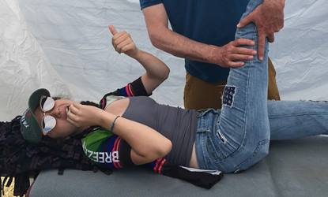
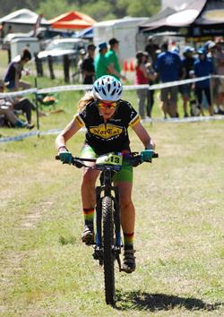

##  50% Girls by 2025

The Drake Mountain Bike Team has made a public commitment to have half of the team represented by girl riders by 2025 (currently the team is approximately 33% girls).  

### Why do we care?  It is just a number...

Yes it is an abstract thing, this 50%, but it represents an ambitious goal to change the culture of cross-country mountain bike racing.  The Drake MTB team is a member of [NorCal](http://norcalmtb.org), which is a league within the National Interscholastic Cycling League, or [NICA](http://www.nationalmtb.org/).  The mission of these organizations is, simply, to get more kids on bikes by providing a "positive experience for all student-athletes, and helping them to create strong body, mind and character through the sport of cycling".  Last time we checked, approximately half of the student body at Drake is girls, so the 50% goal seems logical for appropriate representation of who attends Drake.  

But why do we care about changing the culture through public statement of this goal?  Drake Coach Laura Childress has been bicycling for a long time and has seen the sport evolve and change, but the ratio of women to men has remained frustratingly low.  Drake Coach Rob Reed has worked in the engineering and technical field for more than 20 years, and has seen similarly poor ratios in the Science Technology Engineering and Math (STEM) fields persist.  If we as a community do not work together to get adequate representation of gender in the fields of endeavor that we choose, then the culture of that field tends to be dominated by ideas, implementations, products, etc, that favor one gender or point of view over another.  The mission of NorCal and NICA is to get more kids on bikes and develop their mind and character through cycling... if we can, through Drake MTB, teach our Riders that there is no one way to ride to achieve success in later life, then we have taken one small but significant step towards changing the culture of cross-country mountain bike racing.  Mental strength, emotional strength, community strength, and physical strength all play important roles in bicycle racing, and we believe that working towards an even balance of gender ratios will help all Riders develop the multiple strengths needed not only for racing but for life beyond high school.

Don't take our word for it though... take a look at this video from our [third race in 2017](https://www.youtube.com/watch?v=0N8iXa_M5oE).  Mental strength, emotional strength, community strength, physical strength - its all there.

Also take a look at this [great NorCal produced video](https://m.youtube.com/watch?v=RMzVFlOF8R4) on the impact of mountain biking on girls. More information can be found in [this article](https://www.trekbikes.com/us/en_US/story/the_new_normal).

****

For more on our amazing #DrakeMTBGirls, see pictures and text below!

#### Hannah Betz - senior

{:style="float: left;margin-right: 12px;margin-bottom: 12px;"}

Starting to mountain bike was the best thing I've ever done for myself. Joining the drake MTB team seemed daunting at first, but with the support of my family and friends that I made before and after joining the club, I went from a total biking beginner to a racer on an incredible competitive team. I mountain bike because it makes me feel great. I hadn't really been a part of a sports team or really even regularly exercised before I joined the team, and it seemed so crazy that I could be having so much fun while also taking care of myself and my body. Racing was hard to get used to and it took a lot of dedication to improve, but it was all worth it. I felt confident and supported by my team from my worst race to my best race. On top of that, I made so many close friends and became part of the enormous mountain bike community that exists in Marin. I literally started from the bottom and it just goes to show that any girl can join the team and feel right at home, no matter the skill level.

****

#### Audrey Fehlhaber - junior

{:style="float: left;margin-right: 12px;margin-bottom: 12px;"}

When I joined the mountain biking team, I had no idea what I was getting into. Little did I know that within a few short months I would meet some of my closest friends, push myself harder than I thought possible, and find my second family. I was hesitant to start biking again, but as someone who tends to go for all or nothing, I let go of my uncertainty and went for it. Biking has become a part of me, and is now hard for me to go without. My positive experiences have been fueled by the passion and support of the tightly knit community that makes up our team. To be a part of this group is something truly special, and I consider myself lucky to ride with those who love mountain biking as much as I do.

****

#### Ceci Hellman - junior

{:style="float: left;margin-right: 12px;margin-bottom: 12px;"}

My name is Ceci Hellman and I am a sophomore on the Drake mountain biking team. Freshman year was my first year mountain biking. I am really grateful for the mountain biking community. Being on such a kind and supportive team has helped me improve and become a better mountain biker. At the beginning of my first season, I was really nervous about the races, but  you are just encouraged to try your best and have fun. I started mountain biking because my parents encouraged me to get more involved with sports, and I thought it seemed really fun. Now mountain biking is one of my favorite activities! I love being on the drake mountain biking team!

****

#### Justine McOuat - junior

{:style="float: left;margin-right: 12px;margin-bottom: 12px;"}

I'm Justine McOuat, currently a sophomore at Drake, and I don't know exactly where I would be without the beautiful Drake Mountain Biking Team. Or let alone, biking in general. I started mountain biking in the summer after 6th grade, after I tried to join a mountain biking club and was shut down by a boy saying "you know this is for advanced riders, right?". Boy, did that tick me off, but man did it push me to prove to him that he was an idiot. I road with my dad and did a mountain bike camp, and then turned into a counselor at that very same camp, where I actively support little kids (especially lil ladies) on the trails and off. That camp was the opening of the ever flourishing mountain biking community, and all of its wonder. I've know since middle school that I was going to be on the Drake team no matter what, so I did. One of the best decisions of my life. The coaches and my teammates have always been so caring and supportive. They helped me fall in love with the sport even more. I'd consider them my second family, and some of my best friends. A special thank you to Rob and Otis for being the best coaches I've ever known, and for starting this 50% by 2025 movement. 
