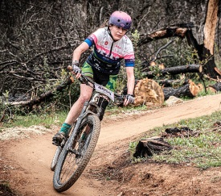
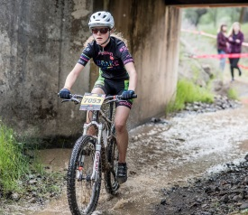
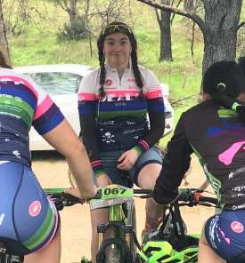
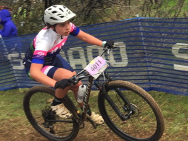

##  50% Girls by 2025

The Drake Mountain Bike Team has made a public commitment to have half of the team represented by girl riders by 2025 (currently the team is approximately 33% girls).  

### Why do we care?  It is just a number...

Yes it is an abstract thing, this 50%, but it represents an ambitious goal to change the culture of cross-country mountain bike racing.  The Drake MTB team is a member of [NorCal](http://norcalmtb.org), which is a league within the National Interscholastic Cycling League, or [NICA](http://www.nationalmtb.org/).  The mission of these organizations is, simply, to get more kids on bikes by providing a "positive experience for all student-athletes, and helping them to create strong body, mind and character through the sport of cycling".  Last time we checked, approximately half of the student body at Drake is girls, so the 50% goal seems logical for appropriate representation of who attends Drake.  

But why do we care about changing the culture through public statement of this goal?  Drake Coach Laura Childress has been bicycling for a long time and has seen the sport evolve and change, but the ratio of women to men has remained frustratingly low.  Drake Coach Rob Reed has worked in the engineering and technical field for more than 20 years, and has seen similarly poor ratios in the Science Technology Engineering and Math (STEM) fields persist.  If we as a community do not work together to get adequate representation of gender in the fields of endeavor that we choose, then the culture of that field tends to be dominated by ideas, implementations, products, etc, that favor one gender or point of view over another.  The mission of NorCal and NICA is to get more kids on bikes and develop their mind and character through cycling... if we can, through Drake MTB, teach our Riders that there is no one way to ride to achieve success in later life, then we have taken one small but significant step towards changing the culture of cross-country mountain bike racing.  Mental strength, emotional strength, community strength, and physical strength all play important roles in bicycle racing, and we believe that working towards an even balance of gender ratios will help all Riders develop the multiple strengths needed not only for racing but for life beyond high school.

Don't take our word for it though... take a look at this video from our [third race in 2017](https://www.youtube.com/watch?v=0N8iXa_M5oE).  Mental strength, emotional strength, community strength, physical strength - its all there.

Also take a look at this [great NorCal produced video](https://m.youtube.com/watch?v=RMzVFlOF8R4) on the impact of mountain biking on girls. More information can be found in [this article](https://www.trekbikes.com/us/en_US/story/the_new_normal).

****

For more on our amazing #DrakeMTBGirls, see pictures and text below!

#### Tiger Macphail - junior

{:style="float: left;margin-right: 12px;margin-bottom: 12px;"}

I've been mountain biking since about 7th grade really. Before that point in time, all I rode bikes for really was getting to school. When I first started mountain biking I was afraid of falling. As I've found people to ride with though, that part of it just up and vanished. I've found the community aspect in it to drive me forward. That sense of community resonated with me in White Hill's club, which spurred me on to the team here. With this great community, I've met some really rad friends. Getting out into nature has always been fun to me. It's even more fun with friends and the reckless abandon I find in myself when biking. I've always had a competitive spirit in me as well so the races have all provided me with an environment to give it my all and get some EPIC panoramas. I may still fall at least once a year, but all that leaves behind is literally a smile.

#### Sadie Marquit - senior

{:style="float: left;margin-right: 12px;margin-bottom: 12px;"}

When I was little, I hated mountain biking and detested being dragged out on rides by my parents. As I got older, my hatred of the sport faded. By the time my freshman year rolled around, I was feeling a little lost, so on a whim I decided to join the mountain bike team. I had no idea that I had just made one of the best decisions of my life. Through the team, I’ve been able to explore miles of beautiful hills and mountains, push myself physically and mentally, meet tons of new people, and most importantly, I’ve become part of an extremely tight knit, welcoming, and supportive community. When the stress of high school gets really overwhelming, there is nothing better than letting your tires hit the dirt with some friends. I’m endlessly grateful for every ride, and each one is a tiny adventure that I will treasure forever.

#### Joylyn “Mimi” Freund - senior

{:style="float: left;margin-right: 12px;margin-bottom: 12px;"}

The first time I ever rode a mountain bike was during the first team ride of my season, freshman year. Immediately, I knew this would be the sport I would stay with throughout high school and beyond. The people I met, the friends I made, the community that surrounded me was full of supportive, encouraging, fun people! Everyone on the team is there for each other. One of my favorite parts of the races is to walk the course with some team members, cheering for those currently racing. As part of the team, I learned how to push myself in ways I hadn’t before, every pedal stroke making me stronger, and the feeling of reaching the top of the mountain was one of the best I’ve ever felt! I love being able to be outdoors with this sport, exploring new territory and improving skills on the bike, both up and downhill. Joining the Drake Mountain Bike Team was one of the best decisions I’ve made. Nothing feels better than feeling the success of a ride or a race when surrounded by an entire community lifting you up.

#### Maggie Nelson - senior

{:style="float: left;margin-right: 12px;margin-bottom: 12px;"}

Mountain biking has been a part of my life ever since I was big enough to ride a bike. It's evolved from weekend rides up Five Corners with my dad to cruising over to Alpine Dam with my friends. Whether I'm pushing myself or just taking it easy, mountain biking is a great escape from the stress that comes with being in high school. With so much to figure out and so many things to do, finding time to step back can be hard, and mountain biking provides a space for me to do that. Not only do I get a respite from the woes of teenage life, but I also get to spend time with amazing people. The mountain biking community has always been there for me, even when I didn't know it. I've met some of my closest friends and had some of the best times riding my bike, and I can't imagine my life without my feet clipped into pedals.

#### Maya Riley - junior

{:style="float: left;margin-right: 12px;margin-bottom: 12px;"}

Freshman year on the team was my first year of mountain biking ever. It started out sort of rocky (haha puns) but as time went on I grew to love it.  It became a way to have mini adventures on the weekends and after school, as well as just a fun thing to do with pals. Friendly competition and all. Not to mention, pushing yourself to go uphill as fast as you can feels pretty great when you get to the top. There's a nice view, a rush of adrenaline, a real satisfying feeling and then you can shoot downhill as fast as you can go without running over hikers and other riders or stressing out horses. Races were intimidating at first, but after the first few, I started to look forward to them. Mountain biking has become such a big part of my life. I met really friendly people on the team, as well as just out and about on the trails. The team opened up a very rad community that I am so grateful to be a part of.

