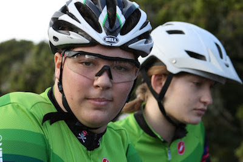

* [#DrakeMTBGirls at Race 3 in 2017](https://www.youtube.com/watch?v=0N8iXa_M5oE)

#### Stella Greeenwood - sophmore

I’m Stella Greenwood and I’m a Junior girl on the Drake Mountain Bike Team. I love mountain biking because it is a fun way to explore our amazing county and exercise at the same time. But more than that, it introduced me to an amazing community that spreads worldwide. I have had the pleasure of riding outside of our tightly knitted community and the fun loving spirit is continuous throughout. Drake MTB is a wonderful group of kids and adults who share the common interest of cycling, but made it so much more than that. I love riding primarily for the people I ride with, and thank everyone for being so amazing. Roll Pirates!

****

#### Elise Nicol - sophmore

I ride because it gives me freedom, joy and a sense of being part of something much larger than just me. Before the Drake team, I had not been part of a team or involved in sports. I didn't feel a sense of belonging and that people had my back no matter what. Now I am part of a family that supports and encourages me in all parts of my life. Mountain biking has made me happier, more fit, and more confident. I look forward to practice because I can escape from stress and be outdoors. I ride for fun, friends, well-being, to push myself, and because I love it.

****

#### Uma Teesdale - junior varsity

****

#### Aliyah Trimble sophmore

I love mountain biking and I love being a part of a supportive team. The Drake mountain biking team is all those things and more. The atmosphere is super welcoming.  Being with the team, coaches and parents feels like being apart of a big supportive family. Everybody is amazing which makes riding with them super fun. The races are also a blast! It’s a great experience.

****

#### Lilly Willis sophmore

There is wind on my face, cooling the sweat. I am surrounded by people who love me and whom I love. Breathing hard, I am alert, focused, happy. I am on a team ride.
I ride for the people. Lots of my all-time favorite people are on this team. The community of loving, supportive people is a must-have in high school, and no one does it better than Drake MTB!
Not to mention the strength I've built over the seasons. Not only physical, though no one can deny we are fit, but mental and emotional. I've pushed myself beyond everything I thought I was capable of, and grown into a stronger person because of it.
And what fun it is! I can picture us girls after our race, on our feet, despite the long day, cheering our boys on with unconditional love and energy. It is the best image of our supportive community I can conjure up.
We may be the Drake MTB Divas, but we are not your average diva. We are loving, strong, supportive, and fun-loving girls who ride their bikes. A lot.

****

#### Jade Zaleski sophmore

I started mnt biking because I loved the idea of fun downhills, and that their was a whole team for it at Drake high school. I now know it is a lot more work than just fun downhills, its a great workout each day. I never thought racing would be so much fun either, but it is such an awsome supportive community that I wouldn't have it any other way! The team is amazing!

****

#### Hannah Childress - junior varsity

 Hey everyone! My name is Hannah Childress and I am a senior riding Varsity this year. I am so excited to meet everyone and get together to share one common interest, the love of mountain biking! I want all of you to know that it doesn’t matter how long you have been riding, or what bike you have, or what shoes you wear, it’s all about your attitude on the bike. This has always been something really important to the Drake MTB Team, because we know that this can affect the way you and lots of the people around you ride. This year my goal is to make sure that everyone knows that they have a place on the team (and to learn everyone’s names) Feel free to contact me anytime with questions, concerns or especially if you want to go on a ride! hg.childress@gmail.com It’s gonna be a rad year! Go Pirates!

****

#### Lisette Werba - junior varsity

****
