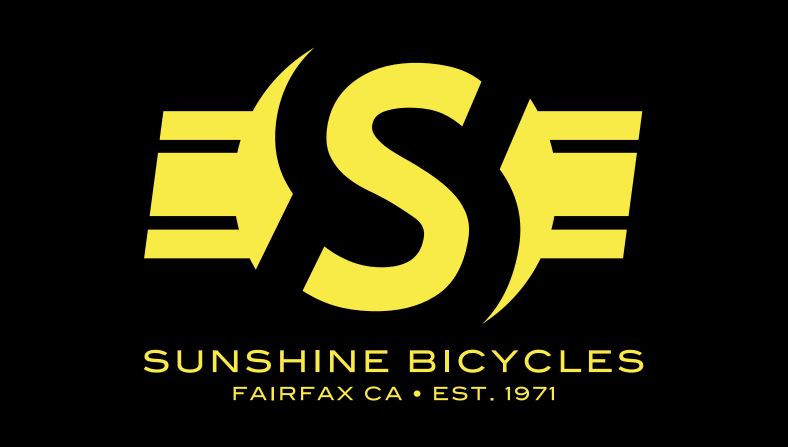
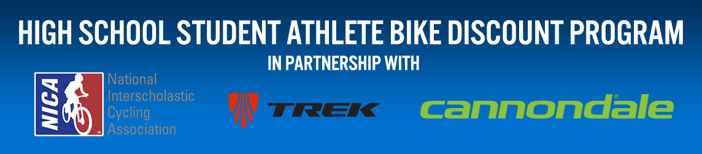

*Below is a list of the 2018-19 Drake MTB Sponsors. Check them out! Use their services!! Drake MTB must raise 100% of the funds we need every season. We do not receive financial support from the school since we are considered a club sport opposed to an MCAL sport. Therefore, we are very grateful for our sponsors’ support. Without their generosity, the team would not be able to thrive and feel so supported on and off the trails. Thank you to each and everyone one!*

***
# Primary Sponsors

|     |      |
:---  | ---:
 | **Drake Team Deal:**  30% off Breezer Bikes  20% off other products  Only at 3 Ring Cylces  Phone# (415)-259-5704  

 | Travis and Jennifer have a Senior on the team  

***
***
## Secondary Sponsors

|     |      |
:---  | ---:
 | **Official Shop of Drake MTB!**    

 |    |

 | **Nationwide Commercial Equipment Financing** Direct Financing Division Clearview Financial Phone# (888)-408-8805  

 | 237 Crescent Road, Suite 4 San Anselmo, CA 94960 Phone# (415)-485-1196 CONNECT@THINKDOVETAIL.COM Stephanie O'Brien is the proud parent of a racing alumni  

 | **Orthodontist to Biking Stars…Like alumni Ben Enbom and Dean Lyons** 5th Street in San Rafael Phone# (415)-456-3893  

 | **Top Producing Real Estate team in Marin County.** Parents to Liam, a freshman on the team Phone# (415)-515-3587  

***
***
### Associate Sponsors

|     |      |
:---  | ---:
 | **Hydration is Power** Lee Hutchinson has a daughter on the team  

 |    |

 | Philip has a sophomore on the team and an alumni racer  

 | **FirstOnScene is a company with one focus: building the best fire department RMS on the market at the lowest possible price.**  

 | **Exceptional Special Services Builder of Premier Homes Throughout the Bay Area** Phone# (415)-492-2020 

 | 1226 43rd Avenue San Francisco, CA 94122 Phone# (415)-722-5034  

 | Chris Kenton 237 Crescent Road, Suite 5 San Anselmo, CA 94960 Phone# (415)-315-9152 Chris is an assistant coach and has a senior on the team  

***
***
### Product Service

|     |      |
:---  | ---:
 | **Marin Power Yoga**  

***
 | **Pelo Fitness** 

***
 |    |

***
 **In Memory of Jim Miller** 
  
